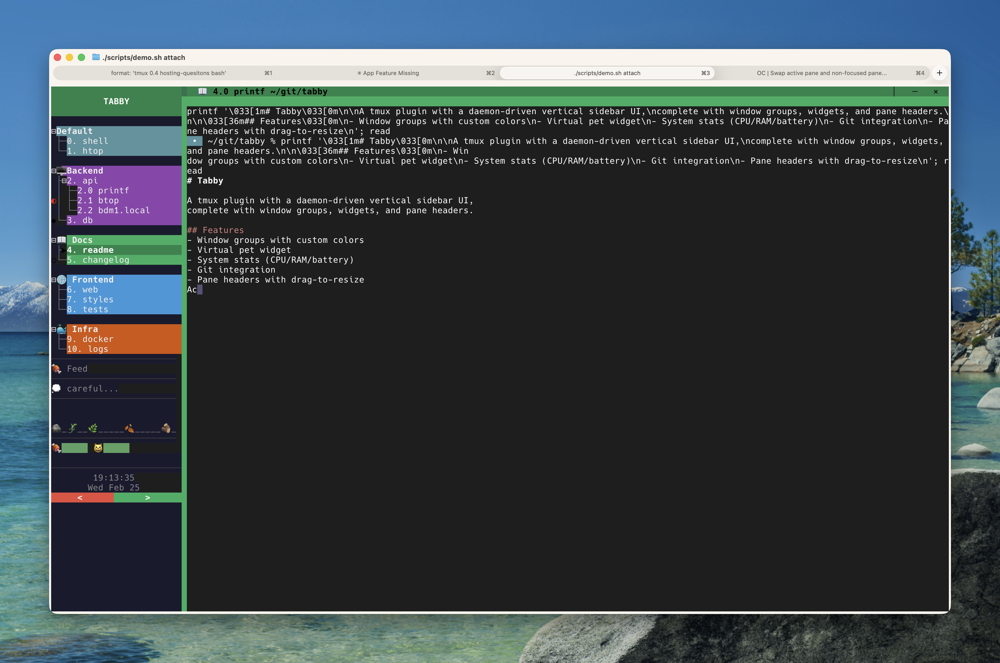
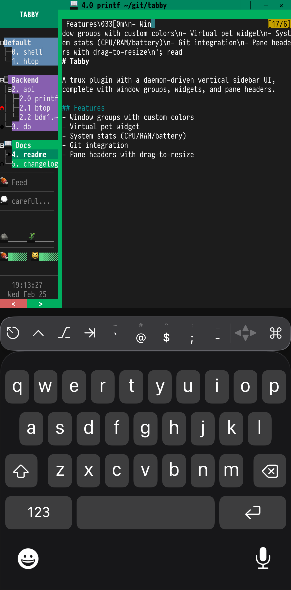
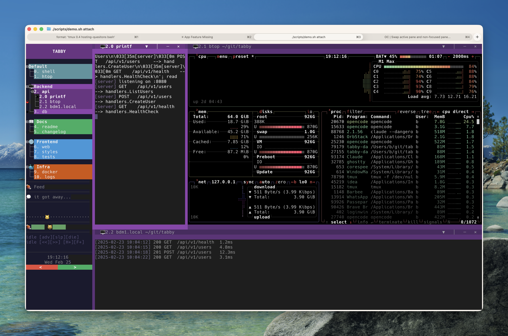
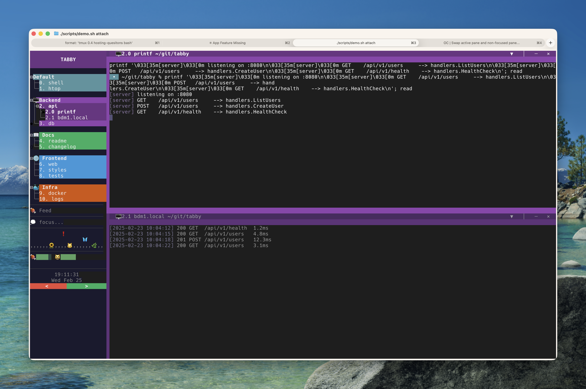

# Tabby

<p align="center">
  
  
</p>

<p align="center">
  
  
</p>

A modern tab manager for tmux with grouping, a clickable vertical sidebar, and deep linking for notifications.

## Table of Contents

- [About This Project](#about-this-project)
- [Key Features](#key-features)
- [All Features](#all-features)
- [Installation](#installation)
- [Usage](#usage)
- [Configuration](#configuration)
- [Tab Grouping](#tab-grouping)
- [Development](#development)
- [macOS Notifications with Deep Links](#macos-notifications-with-deep-links)
- [Session Persistence (tmux-resurrect)](#session-persistence-tmux-resurrect)
- [Troubleshooting](#troubleshooting)
- [Contributing](#contributing)
- [License](#license)

## About This Project

Tabby started as an opinionated solution to a personal problem: managing dozens of tmux windows across multiple projects without losing context. It grew into something others might find useful.

**Design Philosophy:**
- Customizable - support for Nerd Fonts, emoji, ASCII, and various terminal features
- Modular - enable only the features you need (sidebar, pane headers, widgets, etc.)
- Extensible - widget system for adding custom sidebar content (clock, git status, pet, stats, Claude usage)
- Terminal-agnostic - works with most modern terminals (Ghostty, iTerm, Kitty, Alacritty, etc.)

**Contributing:** PRs are welcome. This is actively developed but cannot promise support for all terminal emulators or use cases. If you find Tabby useful or have ideas, contributions are appreciated.

## Key Features

### Vertical Sidebar
A persistent, clickable sidebar that works across all your windows. Left-click to switch, right-click for context menus, middle-click to close. Full mouse support that tmux's native status bar can't provide.

### Window Grouping
Organize windows by project with color-coded groups. Windows are automatically grouped by pattern matching or manually assigned via right-click menu. Each group has its own theme colors and optional icon.

### Deep Links for Notifications
Click a notification to jump directly to the right tmux session, window, and pane. Perfect for long-running tasks - get notified when done and click to return instantly.

```bash
# Example: notification that deep-links back to tmux
terminal-notifier -title "Build Done" -message "Click to return" \
  -execute "~/.tmux/plugins/tabby/scripts/focus_pane.sh main:2.1"
```

## All Features

- **Vertical sidebar** - clickable, persistent across windows with collapse/expand
- **Window grouping** - color-coded project organization with working directories
- **Deep link navigation** - click notifications to jump to exact pane
- **Automatic window naming** - shows running command, locks on manual rename
- **Activity indicators** - bell, activity, silence, busy, and input alerts
- **Mouse support** - click, right-click menus, middle-click close
- **Custom tab colors** - per-window color overrides, including transparent mode
- **Pane management** - rename panes with title locking
- **Group management** - create, rename, color, collapse, and set working directories
- **SSH bell notifications** - auto-enable bells on remote command completion
- **Keyboard navigation** - intuitive shortcuts for everything

## Installation

### Via TPM (Tmux Plugin Manager)
Add to your `~/.tmux.conf`:
```bash
set -g @plugin 'brendandebeasi/tabby'
```

Then reload tmux and install:
```bash
tmux source ~/.tmux.conf
# Press prefix + I to install plugins
```

### Manual Installation
```bash
git clone https://github.com/brendandebeasi/tabby ~/.tmux/plugins/tabby
cd ~/.tmux/plugins/tabby
./scripts/install.sh
```

Add to your `~/.tmux.conf`:
```bash
run-shell ~/.tmux/plugins/tabby/tabby.tmux
```

## Usage

### Keyboard Shortcuts

Tabby follows standard tmux keybindings. All standard tmux shortcuts work as expected.

#### Standard tmux shortcuts (prefix + key)

| Key | Action |
|-----|--------|
| `prefix + c` | Create new window |
| `prefix + n` | Next window |
| `prefix + p` | Previous window |
| `prefix + x` | Kill current pane |
| `prefix + q` | Display pane numbers |
| `prefix + w` | Window list |
| `prefix + ,` | Rename window |
| `prefix + "` | Split horizontal |
| `prefix + %` | Split vertical |
| `prefix + d` | Detach from session |
| `prefix + 1-9,0` | Switch to window by number |

#### Tabby-specific shortcuts

| Key | Action |
|-----|--------|
| `prefix + Tab` | Toggle vertical sidebar |
| `prefix + G` | Create new group |
| `Ctrl + <` or `Alt + <` | Collapse/expand sidebar |
| `Cmd + Shift + \` | Collapse/expand sidebar (requires [terminal config](#sidebar-collapse-shortcut)) |
| `Alt + a` | Toggle all-windows overview mode |

When the sidebar is focused, press `m` to open the marker picker for the active window.

### Mouse Support (Vertical Sidebar)

- **Left click**: Switch to window/pane
- **Click right edge**: Click the divider to collapse sidebar
- **Middle click**: Close window (with confirmation)
- **Right click on window**: Context menu with options:
  - Rename (with title locking)
  - Unlock Name (restore automatic naming)
  - Collapse/Expand Panes
  - Move to Group
  - Set Marker (searchable emoji picker)
  - Set Tab Color (including transparent)
  - Split Horizontal/Vertical
  - Open in Finder
  - Kill window
- **Right click on pane**: Pane-specific options:
  - Rename pane (with title locking)
  - Unlock pane name
  - Split pane
  - Focus pane
  - Break to new window
  - Close pane
- **Right click on group**: Group management:
  - New window in group
  - Collapse/Expand group
  - Rename group
  - Change group color
  - Set Marker (searchable emoji picker)
  - Set working directory
  - Delete group
  - Close all windows in group

### Sidebar Position and Mode

The sidebar can be placed on either side of the window and can span the full height or attach to a single pane.

**Set via tmux options:**
```bash
# Position: left (default) or right
tmux set-option -g @tabby_sidebar_position right

# Mode: full (default, spans full window) or partial (attaches to one pane)
tmux set-option -g @tabby_sidebar_mode partial
```

Toggle the sidebar off and on (`prefix + Tab` twice) after changing these options.

### Sidebar Collapse

The sidebar can be collapsed to maximize screen space:

- **Click the right edge** (divider area) to collapse
- **Keyboard**: `Ctrl+<` or `Alt+<` to toggle
- **Collapsed state**: Shows `>` down the entire height - click anywhere to expand

When collapsed, the sidebar takes only 2 characters of width. When expanded, it restores to your configured width.

#### Sidebar Collapse Shortcut

Tabby includes `scripts/toggle_sidebar_collapse.sh` which collapses or expands the sidebar without killing the daemon. Unlike `prefix + Tab` (which fully toggles the sidebar on/off), this keeps the daemon running and just shrinks/restores the sidebar pane.

The script is bound in tmux to `Ctrl+Shift+\` using CSI u encoding:

```bash
# Already configured by tabby.tmux — add to ~/.tmux.conf if needed:
bind-key -n 'C-S-\' run-shell -b '/path/to/tabby/scripts/toggle_sidebar_collapse.sh'
```

**Requires `extended-keys`** in your tmux.conf (tmux 3.2+):
```bash
set -g extended-keys on
set -sa terminal-features 'xterm*:extkeys'
```

To use `Cmd+Shift+\` as the trigger, your terminal must send the CSI u sequence `\x1b[92;6u` (which tmux decodes as `Ctrl+Shift+\`). Configuration varies by terminal:

**Blink Shell** — the recommended mobile terminal for Tabby on iPad/iPhone. See configuration below.

**Ghostty** — add to `~/.config/ghostty/config`:
```
super+shift+backslash=text:\x1b[92;6u
```

On macOS, `Cmd+Shift+\` is bound to "Show All Tabs" by default. Disable it:
```bash
defaults write com.mitchellh.ghostty NSUserKeyEquivalents -dict-add "Show All Tabs" '\0'
# Restart Ghostty after running this
```

**Blink Shell (iPad)** — [https://blink.sh/](https://blink.sh/) — add to your keyboard configuration (`kb.json`):
```json
{
  "keys": "cmd+shift+\\",
  "action": "hex",
  "value": "1b5b39323b3675"
}
```

The hex value `1b5b39323b3675` is the byte representation of `\x1b[92;6u`.

**iTerm2** — add a key mapping in Preferences → Profiles → Keys:
- Shortcut: `⌘⇧\`
- Action: Send Escape Sequence
- Value: `[92;6u`

**Kitty** — add to `~/.config/kitty/kitty.conf`:
```
map cmd+shift+backslash send_text all \x1b[92;6u
```

**Other terminals** — any terminal that can send arbitrary escape sequences will work. Map `Cmd+Shift+\` (or your preferred shortcut) to send the bytes `\x1b[92;6u` (ESC `[` `9` `2` `;` `6` `u`).

### SSH Bell Notifications

Automatically receive bell notifications when commands complete in SSH sessions.

#### Auto-enable for all SSH connections

Add to your `~/.ssh/config`:

```ssh
Host *
  RemoteCommand bash -c 'PROMPT_COMMAND="printf \"\a\""; exec bash -l'
  RequestTTY force
```

This works by injecting a bell into the remote shell's prompt, so you get a notification after every command.

**Note:** This uses `RemoteCommand` which may interfere with tools like `scp`, `rsync`, and `git` over SSH. If you encounter issues, override for specific hosts:

```ssh
Host github.com gitlab.com bitbucket.org
  RemoteCommand none
  RequestTTY auto
```

#### Alternative: Add to remote servers

If you control the remote servers, add this to `~/.bashrc` on each server:

```bash
export PROMPT_COMMAND="${PROMPT_COMMAND:+$PROMPT_COMMAND; }printf '\a'"
```

This approach doesn't require SSH config changes and won't interfere with other tools.

## Configuration

### File Locations

| Category | Path | Env Override |
|----------|------|-------------|
| Config | `~/.config/tabby/config.yaml` | `TABBY_CONFIG_DIR` |
| Pet state | `~/.local/state/tabby/pet.json` | `TABBY_STATE_DIR` |
| Thought cache | `~/.local/state/tabby/thought_buffer.txt` | `TABBY_STATE_DIR` |
| Runtime | `/tmp/tabby-*` | -- |


Edit `~/.config/tabby/config.yaml`:

```yaml
# Tab grouping rules (first match wins)
groups:
  - name: "Frontend"
    pattern: "^FE|"
    working_dir: "~/projects/frontend"  # Default dir for new windows
    theme:
      bg: "#e74c3c"
      fg: "#ffffff"
      active_bg: "#c0392b"
      active_fg: "#ffffff"
      icon: ""

  - name: "Backend"
    pattern: "^BE|"
    working_dir: "~/projects/backend"
    theme:
      bg: "#27ae60"
      fg: "#ffffff"
      active_bg: "#1e8449"
      active_fg: "#ffffff"
      icon: ""

  - name: "Default"
    pattern: ".*"
    theme:
      bg: "#3498db"
      fg: "#ffffff"
      active_bg: "#2980b9"
      active_fg: "#ffffff"

# Indicators
indicators:
  activity:
    enabled: false
    icon: "!"
    color: "#000000"
  bell:
    enabled: true
    icon: "◆"
    color: "#000000"
    bg: "#ffff00"  # Yellow background for visibility
  silence:
    enabled: true
    icon: "○"
    color: "#000000"
  busy:
    enabled: true
    icon: "◐"
    color: "#ff0000"
    frames: ["◐", "◓", "◑", "◒"]  # Animation frames
  input:
    enabled: true
    icon: "?"
    color: "#ffffff"
    bg: "#9b59b6"  # Purple - needs attention
    frames: ["?", "?"]  # Can add blinking: ["?", " "]

# Vertical sidebar settings
sidebar:
  position: left      # "left" or "right"
  mode: full          # "full" (full window height) or "partial" (attach to pane)
  new_tab_button: true
  new_group_button: true
  show_empty_groups: true
  close_button: false
  sort_by: "group"  # "group" or "index"
  colors:
    disclosure_fg: "#000000"
    disclosure_expanded: "⊟"
    disclosure_collapsed: "⊞"
    active_indicator: "◀"  # Active window/pane indicator
    active_indicator_fg: "auto"  # "auto" uses group/window bg color
```

## Tab Grouping

Windows are organized into groups based on name patterns or manual assignment:

```
+---------------------------+
|  SIDEBAR                  |      SESSION
|                           |         |
|  Frontend  [group]        |         +-- Frontend (group)
|    0. dashboard           |         |     +-- 0. dashboard (window)
|    1. components          |         |     |     +-- pane 0: vim
|                           |         |     |     +-- pane 1: terminal
|  Backend   [group]        |         |     +-- 1. components (window)
|    2. api                 |         |           +-- pane 0: npm run dev
|    3. tests               |         |
|                           |         +-- Backend (group)
|  Default   [group]        |         |     +-- 2. api (window)
|  > 4. vim                 |         |     +-- 3. tests (window)
|    5. notes               |         |
|                           |         +-- Default (group)
|  [+] New Tab              |               +-- 4. vim (window) <- active
+---------------------------+               +-- 5. notes (window)
```

### Assigning Groups

**By pattern** - Windows matching a regex are auto-grouped:
- `^FE|` matches `FE|dashboard`, `FE|components`
- `^BE|` matches `BE|api`, `BE|tests`
- `.*` catches everything else in Default

**By right-click menu** - Select "Move to Group" to manually assign

**By tmux option** - Set programmatically:
```bash
tmux set-window-option -t :0 @tabby_group "Frontend"
```

### Custom Colors and Transparent Mode

Set custom colors for individual windows or groups:

**Window colors** - Right-click window → Set Tab Color:
- Predefined colors: Red, Orange, Yellow, Green, Blue, Purple, Pink, Cyan, Gray
- **Transparent**: No background, simple text color (minimal visual)
- Reset to default group color

**Group colors** - Right-click group → Edit Group → Change Color:
- Same color options as windows
- **Transparent**: Clean text-only display for the entire group
- Affects all windows in the group (unless they have custom colors)

**Set programmatically**:
```bash
# Set window to transparent
tmux set-window-option -t :0 @tabby_color "transparent"

# Set window to custom color
tmux set-window-option -t :0 @tabby_color "#e91e63"

# Reset to group color
tmux set-window-option -t :0 -u @tabby_color
```

### Group Working Directories

Set a default working directory for each group. New windows created in the group will automatically use this directory:

**Via context menu**: Right-click group → Edit Group → Set Working Directory

**In config.yaml**:
```yaml
groups:
  - name: "MyProject"
    working_dir: "~/projects/myproject"
    # ...
```

### Pane Management

**Rename panes** with title locking (like window names):
- Right-click pane → Rename
- Locked titles persist until manually unlocked
- Right-click pane → Unlock Name to restore automatic naming

**Set programmatically**:
```bash
# Set locked pane title
tmux set-option -p -t %123 @tabby_pane_title "My Pane"

# Clear locked title
tmux set-option -p -t %123 -u @tabby_pane_title
```

## Development

### Building from Source
```bash
cd ~/.tmux/plugins/tabby
./scripts/install.sh
```

### Commit Hygiene Guardrails
```bash
# Install the local pre-commit guard
./scripts/install-git-hooks.sh
```

This installs a pre-commit hook that blocks committing logs, local agent state,
temporary files, and likely hardcoded secrets.

### Running Tests
```bash
# Comprehensive visual tests
./tests/e2e/test_visual_comprehensive.sh

# Tab stability tests  
./tests/e2e/test_tab_stability.sh

# Edge case tests
./tests/e2e/test_edge_cases.sh
```


## macOS Notifications with Deep Links

Tabby includes helper scripts for creating notifications that deep-link back to specific tmux windows/panes. When clicked, the notification brings your terminal to the foreground and navigates to the target location.

Works with both **Claude Code** and **OpenCode** out of the box.

### Requirements

1. Install a notification tool via Homebrew:
```bash
# Recommended: growlrrr (supports custom emoji icons as thumbnails)
brew install growlrrr

# Alternative: terminal-notifier (basic notifications)
brew install terminal-notifier
```

2. Configure your terminal app in `config.yaml`:
```yaml
# Options: Ghostty, iTerm, Terminal, Alacritty, kitty, WezTerm
terminal_app: Ghostty
```

### Basic Usage

The `focus_pane.sh` script activates your terminal and navigates tmux:

```bash
# Focus window 2, pane 0
~/.tmux/plugins/tabby/scripts/focus_pane.sh 2

# Focus window 1, pane 2
~/.tmux/plugins/tabby/scripts/focus_pane.sh 1.2

# Focus specific session, window, and pane
~/.tmux/plugins/tabby/scripts/focus_pane.sh main:2.1
```

### Sending Notifications with Deep Links

```bash
# Simple notification that jumps to window 2
terminal-notifier -title "Build Complete" -message "Click to view" \
  -execute "$HOME/.tmux/plugins/tabby/scripts/focus_pane.sh 2"

# Notification with current location (useful in scripts/hooks)
TARGET=$(tmux display-message -p '#{window_index}.#{pane_index}')
terminal-notifier -title "Task Done" -message "Click to return" \
  -execute "$HOME/.tmux/plugins/tabby/scripts/focus_pane.sh $TARGET"
```

### Integration with Claude Code

Claude Code hooks run as subprocesses, so you need to capture the correct pane — not the currently focused one. The key is using the `TMUX_PANE` environment variable with `tmux display-message -t`.

**Important:** Using `tmux display-message -p` (without `-t`) returns the *currently focused* pane, which may have changed while Claude was working. Using `-t "$TMUX_PANE"` queries the *specific pane* where the hook originated.

#### Hook Configuration

Add to `~/.claude/settings.json`:

```json
{
  "hooks": {
    "UserPromptSubmit": [
      {
        "matcher": "",
        "hooks": [
          {
            "type": "command",
            "command": "<tabby-dir>/scripts/set-tabby-indicator.sh busy 1"
          },
          {
            "type": "command",
            "command": "<tabby-dir>/scripts/set-tabby-indicator.sh input 0"
          }
        ]
      }
    ],
    "Stop": [
      {
        "matcher": "",
        "hooks": [
          {
            "type": "command",
            "command": "/path/to/your/claude-stop-notify.sh"
          }
        ]
      }
    ],
    "Notification": [
      {
        "matcher": "",
        "hooks": [
          {
            "type": "command",
            "command": "/path/to/your/claude-notification.sh"
          }
        ]
      }
    ]
  }
}
```

Notification scripts should:
- Read hook JSON from stdin (`jq -r '.transcript_path'` for transcript)
- Use `TMUX_PANE` env var to query the originating pane (not current focus)
- Call `focus_pane.sh` for click-to-navigate deep links
- Set tabby indicators (`set-tabby-indicator.sh busy 0`, `bell 1`, etc.)
- Use growlrrr with `--image` for emoji group icon thumbnails

See the [example hook scripts](https://github.com/brendandebeasi/tabby/blob/main/README.md#example-hook-script) or use the built-in OpenCode hook as a reference.

#### Example Hook Script

```bash
#!/usr/bin/env bash
# claude-stop-notify.sh — Rich notification with emoji icons + deep linking
set -u

TABBY_DIR="${HOME}/.tmux/plugins/tabby"
INDICATOR="$TABBY_DIR/scripts/set-tabby-indicator.sh"

# Read hook JSON from stdin (Claude provides session info)
HOOK_JSON=$(cat)
TRANSCRIPT_PATH=$(echo "$HOOK_JSON" | jq -r '.transcript_path // empty')

# Get tmux info for the SPECIFIC pane where Claude runs
# CRITICAL: Use -t "$TMUX_PANE" to query the originating pane, not current focus
if [[ -n "${TMUX:-}" && -n "${TMUX_PANE:-}" ]]; then
    WINDOW_NAME=$(tmux display-message -t "$TMUX_PANE" -p '#W')
    TMUX_TARGET=$(tmux display-message -t "$TMUX_PANE" -p '#{session_name}:#{window_index}.#{pane_index}')
fi

# Extract last assistant message from transcript
MESSAGE="Session complete"
if [[ -n "$TRANSCRIPT_PATH" && -f "$TRANSCRIPT_PATH" ]]; then
    LAST_MSG=$(tac "$TRANSCRIPT_PATH" | grep -m1 '"type":"assistant"' | jq -r '
        .message.content |
        if type == "array" then
            [.[] | select(.type == "text") | .text] | join(" ")
        elif type == "string" then .
        else empty end
    ' 2>/dev/null)
    [[ -n "$LAST_MSG" && "$LAST_MSG" != "null" ]] && \
        MESSAGE=$(echo "$LAST_MSG" | tr '\n' ' ' | sed 's/  */ /g' | cut -c1-300)
fi

# Send notification with click-to-focus (growlrrr preferred, terminal-notifier fallback)
if command -v growlrrr &>/dev/null; then
    growlrrr send --appId ClaudeCode --title "$WINDOW_NAME" \
        --subtitle "Task complete" --sound default \
        --execute "$TABBY_DIR/scripts/focus_pane.sh $TMUX_TARGET" \
        "$MESSAGE" &>/dev/null &
elif command -v terminal-notifier &>/dev/null; then
    terminal-notifier -title "$WINDOW_NAME" -message "$MESSAGE" \
        -sound default -execute "$TABBY_DIR/scripts/focus_pane.sh $TMUX_TARGET" &>/dev/null &
fi

# Set tabby indicators
"$INDICATOR" busy 0
"$INDICATOR" bell 1
```

### Integration with OpenCode

Tabby includes a built-in OpenCode hook at `scripts/opencode-tabby-hook.sh`. It supports:
- All OpenCode events (complete, permission, question, error, start)
- Emoji group icon thumbnails via growlrrr
- SQLite-based message extraction from OpenCode's database
- Process tree walking to find the correct `TMUX_PANE`
- Tabby sidebar indicators (busy, input, bell)

#### OpenCode Notifier Configuration

Create `~/.config/opencode/opencode-notifier.json`:

```json
{
  "sound": false,
  "notification": false,
  "command": {
    "enabled": true,
    "path": "<tabby-dir>/scripts/opencode-tabby-hook.sh",
    "args": ["{event}", "{projectName}", "{sessionTitle}", "{message}"],
    "minDuration": 0
  },
  "events": {
    "complete": { "sound": false, "notification": false },
    "permission": { "sound": false, "notification": false },
    "error": { "sound": false, "notification": false }
  }
}
```

Set `sound` and `notification` to `false` in the notifier config since the hook script handles notifications directly via growlrrr/terminal-notifier.

### Notification Persistence

By default, macOS banner notifications disappear after ~5 seconds. To make them persist until clicked:

1. Open **System Settings** → **Notifications** → **terminal-notifier** (or **growlrrr**)
2. Change notification style from **Banners** to **Alerts**

### Disabling Built-in Notifications

To avoid duplicate notifications when using custom hooks:

**Claude Code** — add to `~/.claude/settings.json`:
```json
{
  "preferredNotifChannel": "none"
}
```

**OpenCode** — set `sound` and `notification` to `false` in `opencode-notifier.json` (shown above).

## Session Persistence (tmux-resurrect)

Tabby integrates with [tmux-resurrect](https://github.com/tmux-plugins/tmux-resurrect) so your sessions survive tmux server restarts and reboots. When resurrect is installed, Tabby automatically:

- **On save** (`prefix + Ctrl-s`): Strips Tabby utility panes (sidebar, pane headers) from the save file so they don't create zombie shell panes on restore.
- **On restore** (`prefix + Ctrl-r`): Cleans stale runtime state, kills leftover processes, and re-initializes the sidebar based on your saved mode.

### Setup

Install tmux-resurrect via [TPM](https://github.com/tmux-plugins/tpm):

```bash
# Add to ~/.tmux.conf (before the Tabby plugin line)
set -g @plugin 'tmux-plugins/tmux-resurrect'
```

Then `prefix + I` to install, or `tmux source ~/.tmux.conf` to reload. That's it — Tabby detects resurrect and wires the hooks automatically.

### What Gets Saved and Restored

| Preserved by resurrect | Restored by Tabby |
|---|---|
| Window layout and names | Sidebar UI |
| Pane working directories | Pane headers |
| Running programs (vim, etc.) | Daemon process |
| Global options (`@tabby_sidebar` mode) | Mouse state cleanup |
| Window groups and custom colors | Runtime files |

### Manual Installation (without TPM)

```bash
git clone https://github.com/tmux-plugins/tmux-resurrect ~/.tmux/plugins/tmux-resurrect
```

Add to `~/.tmux.conf` (before Tabby's `run-shell` line):
```bash
run-shell ~/.tmux/plugins/tmux-resurrect/resurrect.tmux
```

### Hook Coexistence

Tabby only sets the resurrect hook options if they are unset or already owned by Tabby. If you have custom resurrect hooks configured, Tabby will not override them. To use both, chain them in a wrapper script:

```bash
#!/usr/bin/env bash
# my-resurrect-restore-wrapper.sh
/path/to/your/custom-hook.sh
~/.tmux/plugins/tabby/scripts/resurrect_restore_hook.sh
```

## Known Limitations

1. **Mosh does not support mouse events** — Mosh strips mouse escape sequences, so sidebar clicks, right-click context menus, and middle-click close will not work over mosh connections. Keyboard navigation works normally. If you need mouse support, use SSH directly instead of mosh.

## Troubleshooting

### Tabs not appearing
- Ensure Tabby is not explicitly disabled: `tmux show -gv @tabby_enabled` (should not be `0`)
- Run `tmux source ~/.tmux.conf` to reload
- Check if binaries exist: `ls ~/.tmux/plugins/tabby/bin/`

### Sidebar not toggling
- Verify the toggle key binding: `tmux list-keys | grep toggle_sidebar`
- Check if the sidebar binary is running: `ps aux | grep sidebar`

## Zellij Port

**[tabby-zj](https://github.com/brendandebeasi/tabby-zj)** — A port of Tabby to Zellij as a single Rust WASM plugin. Same grouped tab/pane sidebar, context menus, indicators, and widgets — no tmux required.

## Similar Projects

- [cmux](https://github.com/manaflow-ai/cmux) — AI-powered tmux session manager with intelligent window organization

## Contributing

Contributions welcome! Please:
1. Fork the repository
2. Create a feature branch
3. Run the test suite
4. Submit a pull request

## License

MIT License - see LICENSE file for details
