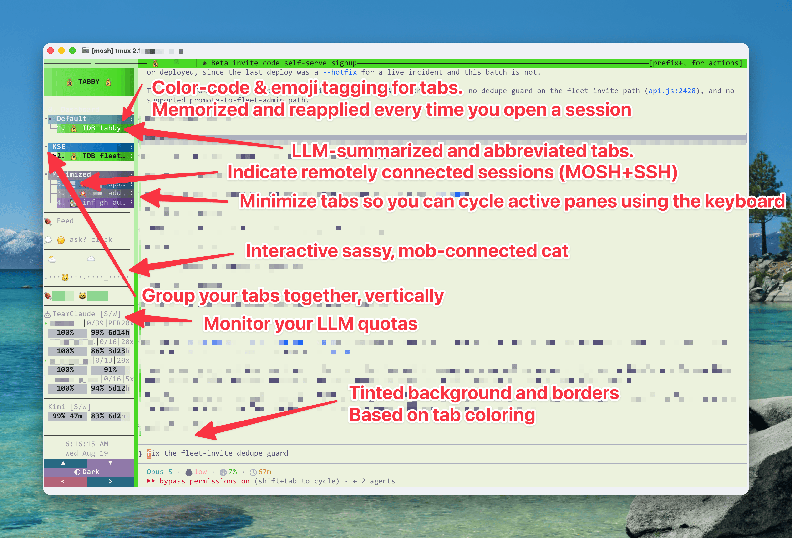
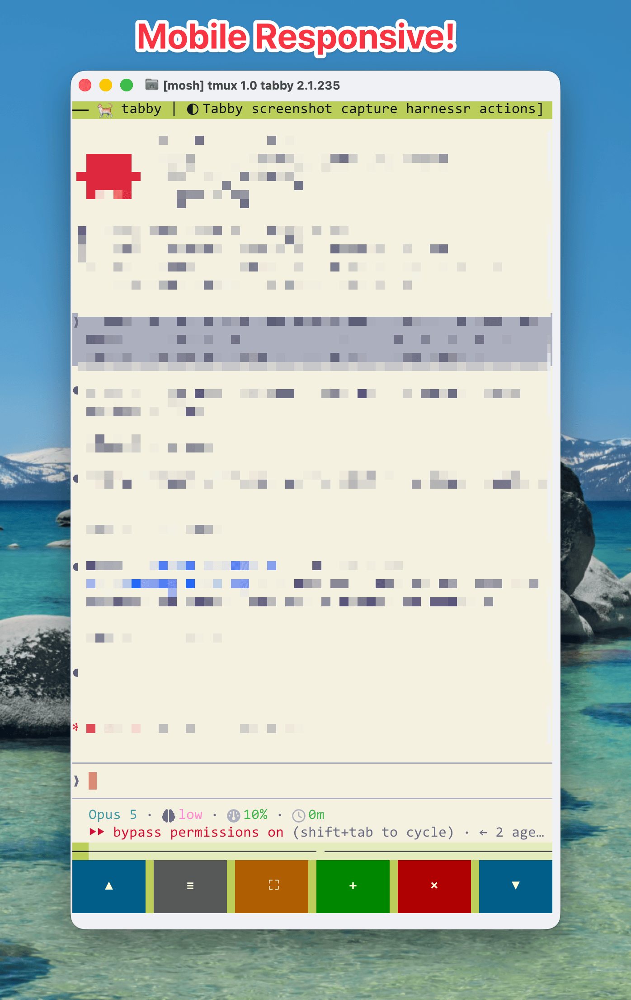
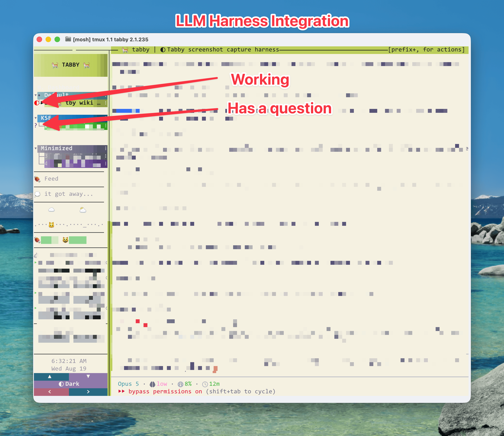
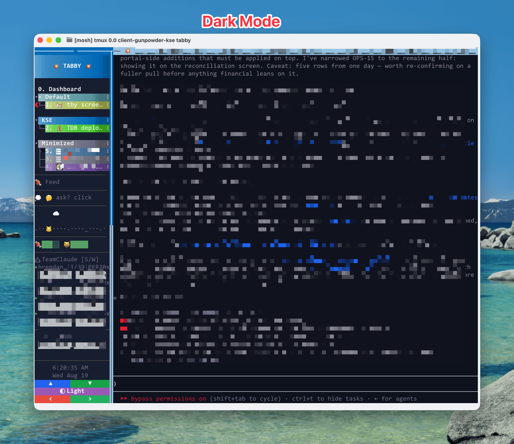
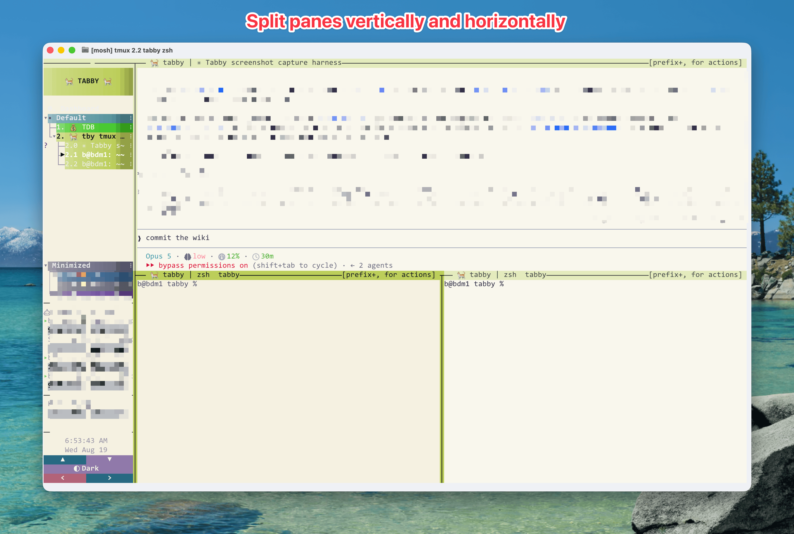

# Tabby

<table>
<tr>
<td width="72%"></td>
<td width="28%"></td>
</tr>
<tr>
<td align="center"><b>Sidebar on a wide terminal</b><br/>Windows, groups, and widgets down the left edge.</td>
<td align="center"><b>Mobile layout</b><br/>Under 110 columns the sidebar drops to icons.</td>
</tr>
</table>

<table>
<tr>
<td width="50%"></td>
<td width="50%"></td>
</tr>
<tr>
<td align="center"><b>AI tool indicators</b><br/>Running agents are flagged per window and per pane.</td>
<td align="center"><b>Dark theme</b><br/>One of 15 built-in themes.</td>
</tr>
</table>

<table>
<tr>
<td width="50%"></td>
<td width="50%"></td>
</tr>
<tr>
<td align="center"><b>Dashboard</b><br/>Every pane joined into one tiled window, then put back.</td>
<td align="center"><b>Pane headers</b><br/>Titles that survive vertical and horizontal splits.</td>
</tr>
</table>

A tab manager for tmux: a clickable vertical sidebar, colour-coded window
groups, per-pane headers, and notifications that jump back to the exact pane
that sent them.

## Install

With [TPM](https://github.com/tmux-plugins/tpm), add to `~/.tmux.conf`:

```bash
set -g @plugin 'brendandebeasi/tabby'
```

Reload with `tmux source ~/.tmux.conf`, then press `prefix + I`.

Without TPM:

```bash
git clone https://github.com/brendandebeasi/tabby ~/.tmux/plugins/tabby
cd ~/.tmux/plugins/tabby && ./scripts/install.sh
```

Then add `run-shell ~/.tmux/plugins/tabby/tabby.tmux` to `~/.tmux.conf`.

You need tmux 3.2 or newer, and `set -g mouse on` if you want to click things.

## Quick start

The sidebar appears on the left as soon as the plugin loads. Five things worth
trying in your first ten minutes:

**Click a window in the sidebar** to switch to it. Right-click one for rename,
colour, marker, and move-to-group. Middle-click closes it.

**Group your windows** by naming them with a prefix. Rename two windows to
`API|server` and `API|logs` and both land under an API group sharing a colour:

```bash
tmux rename-window 'API|server'
```

**Gather every pane into one view** with `prefix + 0`. Your panes move into a
single tiled window, still live and interactive. `prefix + z` zooms into one,
`prefix + L` picks a different arrangement, `prefix + 0` sends them home.

**Switch themes** with `prefix + T`. Fifteen themes ship, paired light and
dark.

**Deep-link a notification** so clicking it returns you to the pane that fired
it:

```bash
terminal-notifier -title "Build done" -message "Click to return" \
  -execute "~/.tmux/plugins/tabby/bin/tabby hook focus-pane main:2.1"
```

More in the [Quick Start](docs/wiki/Quick-Start.md) guide.

## What it does

| Feature | Detail |
|---|---|
| Vertical sidebar | Clickable and persistent across windows. Left-click switches, right-click opens context menus, middle-click closes. Collapse it from the hamburger, a key, or the CLI. |
| Window groups | Colour-coded by project, assigned by name pattern or right-click. Each group carries its own colour, icon, and working directory. |
| Dashboard | `prefix + 0` gathers every pane into one tiled window and back again. Seven arrangements, including two where the focused pane takes the main slot. |
| Pane headers | Per-pane titles with clickable controls, inactive-pane dimming, and border styling. |
| Deep links | Click a notification to land on the exact session, window, and pane. |
| Activity indicators | Bell, activity, silence, busy, input, and SSH hooks, forwarded over OSC 7700. |
| AI tool detection | Recognises when opencode, gemini, codex, aider, cursor, copilot, or grok is working and marks the window busy. |
| Responsive layout | Separate mobile, tablet, and desktop profiles. Narrow windows get a compact sidebar; phones get a window header with nav buttons. |
| Widgets | Clock, pet, git, session, stats, and Claude and Kimi quota, pinnable in the sidebar. |
| Themes | Fifteen built in, paired for a `prefix + T` light/dark toggle that works locally and over SSH. |
| Mouse | Click, right-click menus, middle-click close, drag to resize, and OSC 52 copy that survives SSH. |
| Session persistence | Clean save and restore of sidebar state through tmux-resurrect. |

## Documentation

The [wiki](docs/wiki/Home.md) is the full reference.

**Getting started**

| Page | Covers |
|---|---|
| [Installation](docs/wiki/Installation.md) | TPM and manual install, requirements, first run |
| [Quick Start](docs/wiki/Quick-Start.md) | The first ten minutes |
| [Keyboard and Mouse](docs/wiki/Keyboard-and-Mouse.md) | Every binding, click, and context menu |

**Configuration**

| Page | Covers |
|---|---|
| [Configuration](docs/wiki/Configuration.md) | `config.yaml`, file locations, how settings merge |
| [Themes](docs/wiki/Themes.md) | The fifteen themes, pairing, terminal background |
| [Groups and Colors](docs/wiki/Groups-and-Colors.md) | Grouping rules, per-window colours, working directories |
| [Sidebar](docs/wiki/Sidebar.md) | Position, mode, collapse, sort order |
| [Pane Headers](docs/wiki/Pane-Headers.md) | Titles, dimming, borders, resize controls |
| [Dashboard](docs/wiki/Dashboard.md) | Gathering panes, layouts, promote and move |
| [Responsive Layout](docs/wiki/Responsive-Layout.md) | Breakpoints and width rules |
| [Widgets](docs/wiki/Widgets.md) | Every widget and its settings |

**Integrations**

| Page | Covers |
|---|---|
| [Notifications and Deep Links](docs/wiki/Notifications-and-Deep-Links.md) | Click-to-focus, Claude Code, OpenCode, Grok CLI |
| [AI Tool Indicators](docs/wiki/AI-Tool-Indicators.md) | Busy detection and driving indicators from scripts |
| [SSH and Remote Hosts](docs/wiki/SSH-and-Remote-Hosts.md) | Remote bells, themes, and clipboard |
| [Session Persistence](docs/wiki/Session-Persistence.md) | tmux-resurrect setup and coexistence |

**Reference**

| Page | Covers |
|---|---|
| [CLI Reference](docs/wiki/CLI-Reference.md) | Every subcommand |
| [tmux Options](docs/wiki/tmux-Options.md) | Every `@tabby_*` option and env var |
| [Troubleshooting](docs/wiki/Troubleshooting.md) | Symptoms, causes, log files |
| [Architecture](docs/wiki/Architecture.md) | Daemon, renderers, where state lives |
| [Development](docs/wiki/Development.md) | Building, testing, the dev reload loop |

## About

Tabby started as a fix for a personal problem: managing dozens of tmux windows
across projects without losing track of which was which. It grew into something
others might find useful.

Features are modular, so you can run the sidebar without pane headers or
widgets, and the widget system takes custom content. Every glyph set renders,
whether you have Nerd Fonts installed or are stuck with plain ASCII over a
serial console. It works on most modern terminals: Ghostty, iTerm, kitty,
Alacritty, WezTerm.

## Known limitations

Mosh strips mouse escape sequences, so sidebar clicks, context menus, and
middle-click close do not work over mosh. Keyboard navigation is unaffected.
Use SSH directly if you need the mouse.

## Zellij port

[tabby-zj](https://github.com/brendandebeasi/tabby-zj) is a port to Zellij as a
single Rust WASM plugin, with the same grouped sidebar, context menus,
indicators, and widgets. No tmux required.

## Similar projects

[cmux](https://github.com/manaflow-ai/cmux) is an AI-powered tmux session
manager with automatic window organization.

## Contributing

PRs are welcome. Fork, branch, run `make ci`, and open a pull request. Tabby is
actively developed, though support for every terminal emulator and use case is
not something I can promise. See [Development](docs/wiki/Development.md) for the
build and test setup.

## License

MIT. See LICENSE.
