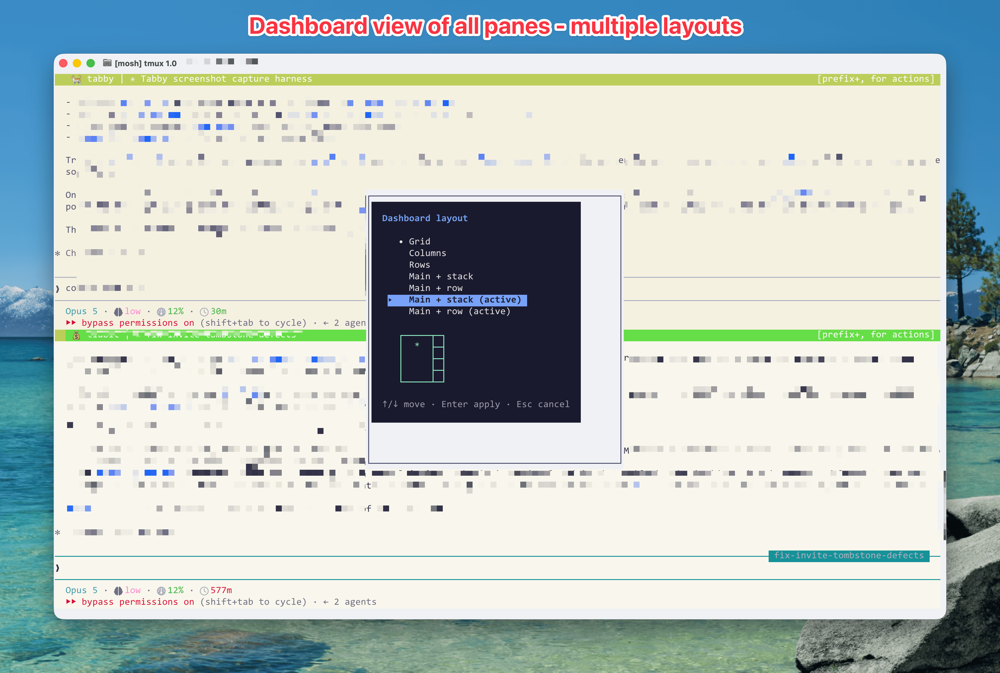

# Dashboard

The dashboard gathers every content pane in the session into one tiled window,
so you can see everything at once. Press it again and every pane goes back to
the window it came from.

<p align="center">
  
  <br/><b>Dashboard</b><br/>Every pane joined into one tiled window, then put back.
</p>

```
prefix + 0
```

`prefix + g` and `Alt+0` do the same thing.

## What it actually does

The panes in the dashboard are your real panes, not previews of them. Tabby
moves them with `join-pane` rather than copying anything, so a pane in the
dashboard is still running its shell, still holds its scrollback, and still
accepts input. Everything native works on it:

| Key | Effect |
|---|---|
| `prefix + z` | Zoom the focused tile to fill the window |
| Arrow keys / `hjkl` with prefix | Move between tiles |
| `prefix + x` | Kill that pane, same as anywhere else |
| Mouse drag on a border | Resize |

There is no separate dashboard keymap to learn, and no card-grid navigation
mode. You are in a normal tmux window with the `tiled` layout applied.

## Getting back

Press `prefix + 0` again. Tabby recreates each origin window from a snapshot it
took on the way in, restoring the window's name, group, and working directory,
then moves each pane home.

Your content is never at risk during the round trip. Origin windows are emptied
and destroyed on entry, but the panes themselves live in the dashboard window
the whole time, and pane ids survive `join-pane`, so focus returns to the pane
you were in.

## Reading the tiles

Each tile's border carries the name of the window the pane came from, not
"Dashboard", along with the pane title and the window's group marker. That is
what makes a gathered view legible when eight tiles are all running `bash`.

When a pane has no useful title, the border falls back to the command and
folder. Tabby specifically ignores bash's default title, since a string like
`b@bdm1: ~` is the same on every pane and tells you nothing.

The right side of each border shows a hint that `prefix + ,` opens the pane
menu.

## Layout

The default is a `tiled` grid, which tmux reflows when the window resizes. To
pick a different arrangement:

```
prefix + L
```

That opens a popup listing the arrangements with an ASCII preview of the
highlighted one.

| Key | Action |
|---|---|
| `Up` / `Down`, or `k` / `j` | Move the cursor, preview follows |
| `Enter` or `Space` | Apply and remember |
| `Esc`, `q`, or `Ctrl+C` | Cancel |

Seven choices: the five native tmux arrangements plus two that track focus.

| Label | tmux layout |
|---|---|
| Grid | `tiled` |
| Columns | `even-horizontal` |
| Rows | `even-vertical` |
| Main + stack | `main-vertical` |
| Main + row | `main-horizontal` |
| Main + stack (active) | `main-vertical-auto` |
| Main + row (active) | `main-horizontal-auto` |

The two `(active)` entries use the same geometry as their `main-*`
counterparts, but the big slot follows focus. Select a different pane and it
swaps into the main position, while the others fall back to a stable order by
pane id, so a pane returns to the same slot each time rather than drifting.

Your choice is stored in `@tabby_dash_layout` and reapplied on the next gather.
You can set it without the picker:

```bash
tmux set-option -g @tabby_dash_layout main-vertical-auto
```

`prefix + L` overrides tmux's default binding for `last-client`, which Tabby
does not otherwise use.

## Moving panes around

These work on the focused content pane and skip the sidebar and header panes.
Inside the dashboard they reflow to whichever layout is active, so `main-*`
arrangements rebuild correctly rather than just swapping two panes.

| Key | Action |
|---|---|
| `prefix + P` | Promote the pane to the main slot |
| `prefix + {` | Move it one slot back |
| `prefix + }` | Move it one slot forward |

Promote is also in the right-click pane menu as Promote to Primary.

`prefix + {` and `prefix + }` override tmux's defaults, which are a raw
`swap-pane -U` / `-D` that neither skips Tabby's own panes nor rebuilds a
`main-*` layout.

## Options

| Option | Meaning |
|---|---|
| `@tabby_dashboard` | Set to `1` on the dashboard window. This is how Tabby recognises it. |
| `@tabby_dash_bg_active` | Background for the active tile. |
| `@tabby_dash_bg_inactive` | Background for inactive tiles. |
| `@tabby_dash_layout` | The chosen arrangement, reapplied on each gather. Defaults to `tiled`. |
| `@tabby_dash_origin` | Per pane. The window id it came from. |
| `@tabby_dash_origin_name` | Per pane. The origin window's name, used in the border. |
| `@tabby_dash_origin_icon` | Per pane. The origin window's marker. |
| `@tabby_dash_origin_color` | Per pane. The origin window's group colour. |

The four `@tabby_dash_origin*` options are set on gather and cleared on
restore. Reading them is a reliable way to script against a gathered pane;
setting them by hand is not useful.

## When it does not open

`tabby dashboard` is a thin client that sends one message to the session
daemon. If the daemon is down, nothing happens and tmux stays silent rather
than flashing an error.

The command retries the socket four times over roughly 2.8 seconds before
giving up, which covers a watchdog respawn or a build sync in progress. If it
still fails after that, the daemon is genuinely not running. See
[Troubleshooting](Troubleshooting.md).

One behaviour worth knowing: while the dashboard is the active window, Tabby
skips its usual daemon refresh on pane selection. Moving between tiles does not
change anything the sidebar depends on, so the refresh would be wasted work.

## Related

- [Keyboard and Mouse](Keyboard-and-Mouse.md) for the full binding list
- [Sidebar](Sidebar.md) for the always-on view of the same windows
- [tmux Options](tmux-Options.md) for every option named here
